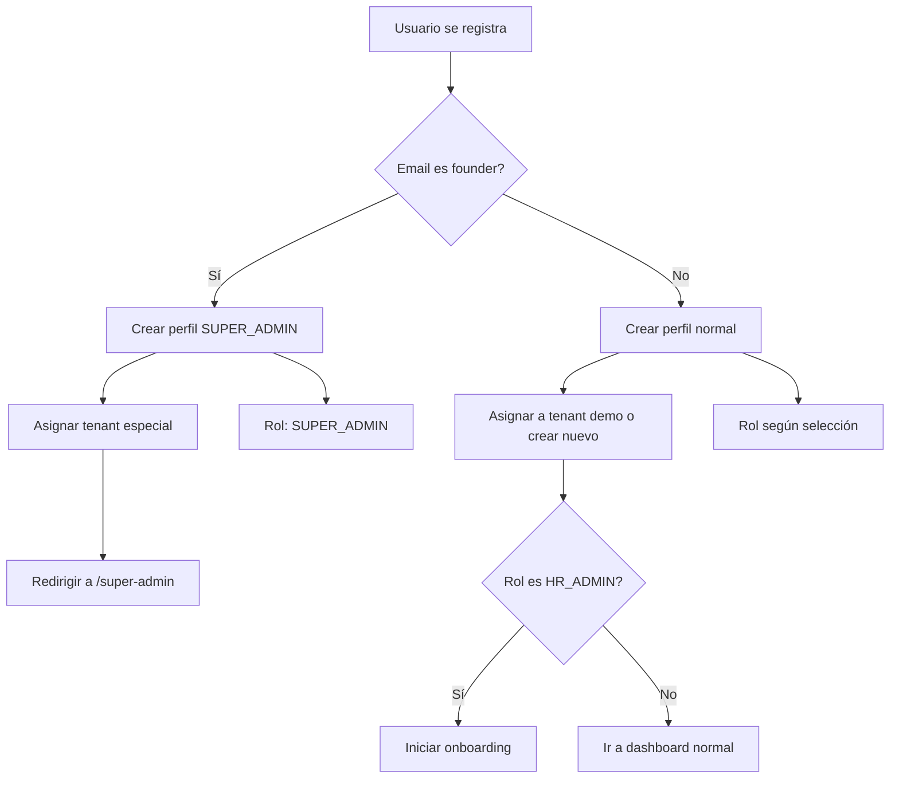

# Guía de Super Administrador - REBEN

## ¿Qué es un SUPER_ADMIN?

Los **SUPER_ADMIN** (Super Administradores) son los founders y administradores de plataforma que pueden:

- 🏢 **Ver y gestionar todos los tenants (empresas)** registrados en REBEN
- 📊 **Acceder a métricas agregadas** de toda la plataforma
- 🔧 **Configurar planes de suscripción** y precios
- 👥 **Gestionar el estado de las empresas** (activar, suspender)
- 📈 **Ver métricas globales** de uso y adopción

## Email de Founder

El email configurado como founder es: **info.emotiontrack@gmail.com**

## Cómo Registrarse

### Para Founders (info.emotiontrack@gmail.com)

1. Ve a `/login`
2. Haz clic en la pestaña **"Registrarse"**
3. Completa el formulario:
   - **Nombre**: Tu nombre
   - **Email**: `info.emotiontrack@gmail.com`
   - **Rol**: Selecciona cualquier rol (se auto-asignará SUPER_ADMIN)
   - **Contraseña**: Elige una contraseña segura
4. Al confirmar, automáticamente se te asignará el rol `SUPER_ADMIN`
5. Serás redirigido a `/super-admin` con acceso completo

### Para Empresas Clientes (HR Admin)

1. Ve a `/login`
2. Haz clic en **"Registrarse"**
3. Selecciona el rol **"HR Admin - Configurar empresa"**
4. Al iniciar sesión, pasarás por el **wizard de onboarding** para:
   - Configurar los datos de la empresa
   - Importar empleados masivamente
   - Activar las funciones de IA

## Dashboard de Super Admin

Una vez autenticado como SUPER_ADMIN, accederás a `/super-admin` donde podrás:

### Vista de Empresas
- Lista completa de todos los tenants
- Estado de cada empresa (activa, suspendida)
- Plan de suscripción asignado
- Métricas por empresa:
  - Número de usuarios
  - Check-ins realizados
  - Alertas generadas
  - Última actividad

### Métricas de Plataforma
- **Empresas totales**
- **Usuarios activos** en toda la plataforma
- **Check-ins del mes**
- **Alertas críticas** agregadas
- **MRR (Monthly Recurring Revenue)**
- **ARR (Annual Recurring Revenue)**

### Acciones Disponibles
- ✅ Activar/Suspender empresas
- ✏️ Editar información del tenant
- 📊 Ver métricas detalladas
- 💰 Gestionar facturación

## Separación de Datos

Los SUPER_ADMIN tienen:
- **Tenant ID especial**: `00000000-0000-0000-0000-000000000000`
- **Sin datos operacionales**: No tienen empleados, equipos ni check-ins propios
- **Acceso de solo lectura** a datos de otras empresas
- **No pasan por onboarding** al iniciar sesión

## Rutas Protegidas

### Accesibles solo por SUPER_ADMIN
- `/super-admin` - Dashboard principal

### Bloqueadas para SUPER_ADMIN
- `/check-in` - Check-ins diarios (solo empleados)
- `/team` - Vista de equipo (managers/HR)
- Onboarding wizard (automáticamente omitido)

## Seguridad

- El email de founder está **hardcoded** en la base de datos
- La función `is_founder_email()` verifica el email en el registro
- El trigger `handle_new_user()` auto-asigna el rol SUPER_ADMIN
- Las RLS policies permiten acceso total solo a SUPER_ADMIN
- Los datos de empresas cliente están protegidos por tenant_id

## Añadir Más Founders

Para añadir más emails de founder:

```sql
-- Editar la función is_founder_email
CREATE OR REPLACE FUNCTION public.is_founder_email(email TEXT)
RETURNS BOOLEAN AS $$
BEGIN
  RETURN email IN (
    'info.emotiontrack@gmail.com',
    'otro-founder@example.com'
  );
END;
$$ LANGUAGE plpgsql SECURITY DEFINER;
```

## Arquitectura Multi-Tenant

```
┌─────────────────────────────────────┐
│  REBEN Platform (Super Admin)      │
│  Tenant: 00000000-0000-0000...     │
│  - Gestión de empresas              │
│  - Métricas globales                │
└─────────────────────────────────────┘
              │
              ├─────────────────┬─────────────────┬──────────
              │                 │                 │
         ┌─────────┐       ┌─────────┐     ┌─────────┐
         │ Empresa │       │ Empresa │     │ Empresa │
         │    A    │       │    B    │     │    C    │
         │ tenant_1│       │ tenant_2│     │ tenant_3│
         └─────────┘       └─────────┘     └─────────┘
```

## Flujo de Registro



## Soporte

Para cualquier duda sobre el sistema SUPER_ADMIN:
- 📧 Email: info.emotiontrack@gmail.com
- 📚 Documentación: Ver archivos PRODUCTION_READY.md y MVP_SUMMARY.md
